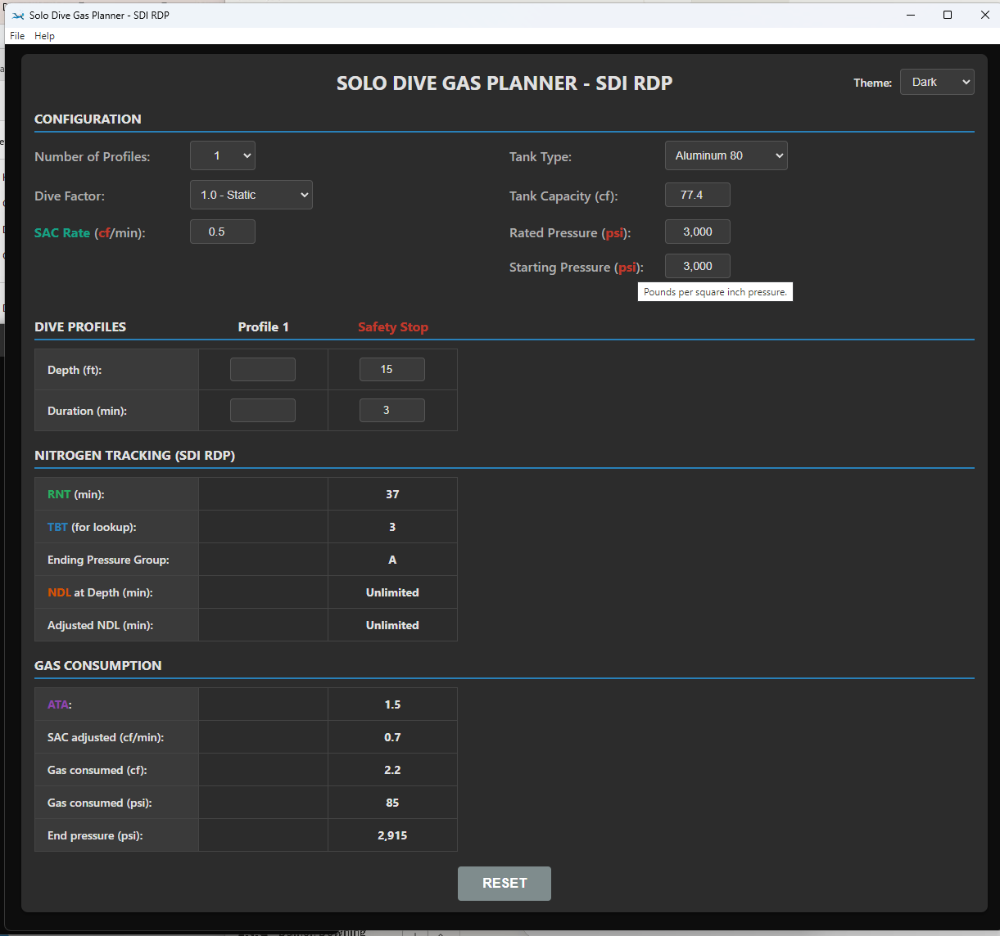
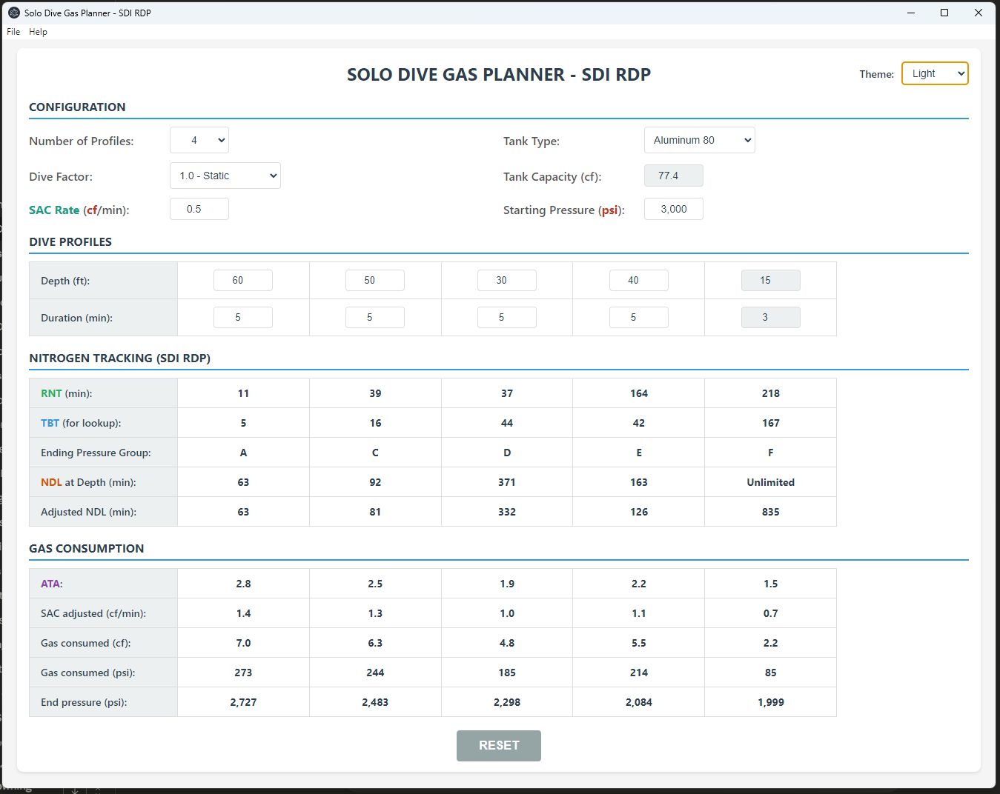

There is also an online version you can use: https://solodiver.damon1974.com
Thanks.


# Solo Dive Gas Planner - SDI RDP

A desktop application for planning solo dives using SDI (Scuba Diving International) Recreational Dive Planner methodology. Calculate nitrogen loading, gas consumption, and multi-profile dive plans.



## Features

- **Multi-Profile Planning**: Plan up to 5 dive profiles plus mandatory safety stop
- **SDI RDP Integration**: Full implementation of SDI nitrogen tracking tables
- **Gas Consumption**: Real-time tank pressure calculations with multiple tank types
- **Dive Factors**: Pre-configured workload multipliers (Easy, Moderate, Tough, Stressful, Severe)
- **Dark/Light Themes**: System-aware theming with manual override
- **Update Notifications**: Automatic GitHub release checking

## Installation

### Windows

1. Download the latest `.exe` from [Releases](https://github.com/Hackpig1974/solo-diver-gas-planner/releases)
2. Run the executable (no installation required - portable app)

## Usage

1. **Configure dive parameters**:
   - Select number of profiles (1-5)
   - Choose tank type or enter custom capacity
   - Set your SAC (Surface Air Consumption) rate
   - Select dive factor based on expected workload

2. **Enter dive profiles**:
   - Depth (ft) for each profile
   - Duration (min) at each depth
   - Safety stop (15ft, 3min) is automatic

3. **Review calculations**:
   - **RNT**: Residual Nitrogen Time carried from previous profile
   - **TBT**: Total Bottom Time used for pressure group lookup
   - **NDL**: No-Decompression Limit at current depth
   - **ATA**: Atmospheres Absolute (pressure at depth)
   - Gas consumption in cubic feet and PSI



## SDI RDP Methodology

This application implements the SDI Recreational Dive Planner tables:

- **Group Designation Table (GDT)**: Maps dive time to pressure groups A-Z
- **Residual Nitrogen Time (RNT) Table**: Carries nitrogen loading across profiles
- **Multi-level dive calculations**: Cumulative nitrogen tracking through ascent profiles

### Important Notes

- Always ascend between profiles (multi-level diving)
- Safety stop is mandatory for all dives
- Maximum 5 profiles per dive plan
- Consult SDI training materials for proper dive planning procedures

## Development

Built with Electron for cross-platform desktop deployment.

### Setup

```bash
npm install
npm start
```

### Build

```bash
npm run build:win    # Windows executable
```

## Technical Details

- **Architecture**: Secure Electron with context isolation
- **Data**: SDI RDP tables (JSON format)
- **Security**: No Node.js access in renderer, IPC-based communication
- **Update System**: GitHub Releases API integration

## License

GPL-3.0 - See LICENSE file for details

## Author

Developed by Damon Downing, 2026

## Disclaimer

This software is a planning tool only. Always follow proper dive training, certification requirements, and safety procedures. Solo diving carries inherent risks - ensure proper training and equipment before attempting solo dives.

## Support

Report issues: [GitHub Issues](https://github.com/Hackpig1974/solo-diver-gas-planner/issues)
